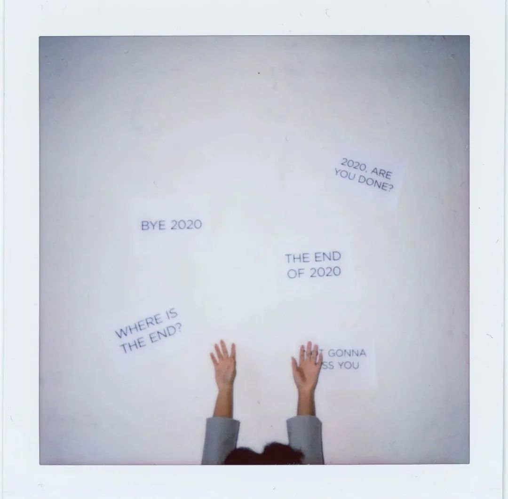

> “ 耳机里的白噪音，雷鸣冬日狂风十月雨无限循环，自我无限放大。”

## 为什么是 October Rain

大家好，我是十雨。

今年真是很特殊的一年，2020 就像夹心饼干，我被挤在里面，很痛，很难受，可他终究还是甜的。

2020 伊始，病毒肆虐，天空和人心灰蒙蒙的，死亡的恐惧弥漫在空气里，人们好像对生活没有了希望，武汉封城，人心惶惶。

好像发生了一件坏事，事事都会变坏一般，年初的那段时间里，人们大喊着重启 2020，又一遍又一遍分析着庚子年发生过的灾难，阴谋论层出不穷。对死亡的恐惧，引发资本市场大跌。同时对未来前途生活的迷茫，让我那段时间非常痛苦。

每天困在自己的小房子里，终日忙忙碌碌，可是心中满是焦虑和迷茫，不清楚什么时候生活才能恢复正常，不清楚什么时候才能回到学校，不知道未来自己到底应该做什么，同时又经历着市场上的巨大波动。那时候每个人都只相信第二天会更坏，我也是。

现在回过头看那段日子，我只觉得我很傻，可是对于当时的我来说，焦虑迷茫痛苦挤满了我全身的每一个细胞，那段时间我不知道我是怎么撑过来的，不过好在是已经过去了。

四月，春天慢慢走近，气温慢慢回升，心也热了起来，生活慢慢好转，我突然 21 岁。四月十六号吧，那天我开始计划读书，在未来无限迷茫的时候，我决定开始读书。

时间一天天的流逝，国外疫情愈演愈烈，与之相对的是五月武汉解封，国内连续数月无新增，乌云散去，而我读的书也一本接着一本，我越来越期待回到学校。

九月，回到学校，心里好像少了什么，2020 只剩下了短短 4 个月，120 天，我决定放下左右摇摆的心思，不再因迷茫而惶惶度日，起码要做点什么吧？我对自己说。恰好知道了一位朋友已经找到了实习，我总算是下定决心也要好好学一门技术，并且在这段时间里只学这一门技术。我想，在年末的时候，起码要给自己和自己对话的底气吧。

用 100 天完成一件事，我的手机锁屏上有这么一句话，我每天尽力早睡早起，尽自己全力学习前端的技术栈，同时坚持每天抽出一些时间读书，每天忙忙碌碌，但是心里真的踏踏实实。

十月的一天，我休息之余，突然想到要不要做一个公众号，作为自己生活的记录，恰巧那段时间我学习时最喜欢的白噪音是 OctoberRain，十月的雨声，孤独但充满力量，酷热结束后的秋雨，让我回忆起年少时冲进大雨里洗刷一切的感受，洗刷所有的污秽，尘垢，简单，干净，孤单。我喜欢这个名字。

十二月的尾巴，OctoberRain 来了，带着我对未来生活的期许，来了。

## 公众号的规划

emmm，对这个公众号的定位呢？主要是自己看到了 bobo 老师的公众号，觉得这种分享真的很有意思，把自己成长中的学习过程，思考，感悟分享出来，真的是一件很有趣的事情吧？

：）

这个公众号主要是对自己的一些记录，分享一些关于我的日常总结，我的读书感悟，我最近学到的新技术，我的投资感悟之类的，暂时没有别的想法，先搞这些吧，hhhh（这样已经很忙了啊喂

关于更新频率只能是随缘了，毕竟没写过公众号，而且是对自己的生活记录，我也不指望很多人看 hhh，希望刚开始一月一篇，等稳定下来之后慢慢提速，最好一周一篇吧，加油加油。

目前的规划就是如此吧，好像也没有太多的规划了。只希望自己能坚持下来。

## 我的 2020

今天是 2020 最后一天诶，不写点什么总是说不过去，毕竟今年虽然过的很让人憋屈，但也是长这么大收获最多的一年。

关于人性，我今年明白了很多，我一直是人之初性本善的坚定支持者，我一直相信世界上每个人都是善良的，从小到大，我对每个人都是真心对待。

可是今年的一些经历，让我觉得这个世界太过复杂，善良与邪恶，并非是非黑即白，一个人的经历，决定了一个人看待事物，以及做事的准则。我曾经以为对的事情，大概只是在这个社会绝大多数人的价值观下形成的道德观念。

对大多数人包括我，可能一些选择是显而易见的，可能对一些人可能就会有截然相反的看法，冲突由此而来，但冲突也可由此而去。每个人坚持自己相信的就好了，不再影响别人，不再打扰对方，如此最好。

关于友情也是，我一直以来都是一个不愿失去任何朋友的人。可是今年我慢慢理解了，友情上的的得失，疏远，都是正常的啊，没有啥永恒的东西，新朋友的到来，老朋友的离去，都太正常不过，所以有些时候不必有太多感伤，随着心智的改变，所有你以为的都会变，尽力保证自己的初心不变就好了。

关于读书，今年从四月中旬开始，陆陆续续读了 30 本书，最难受和痛苦的日子里，都有书陪着我，在最迷茫的时候，我起码都可以告诉自己，起码我还有三十本书，这种感觉踏实，厚重，真的是太棒了。

回忆起今年的这些书，我虽然不能记起全部的细节，但是这些书带给我对事物的理解和体会却历历在目，真的学到很多。过段时间有机会我会把这三十本里我最喜欢的基本写一些推荐发出来，希望大家一起读书呀！

关于投资理财，我其实很纠结到底把我现在的行为归为投资还是理财，说投资吧，我这么菜，啥也不懂，说理财吧，我却也不甘心，所以暂且叫它投资理财吧，希望明年能给他换个我更喜欢的名字。

关于这个我可以说的真的太多太多了，今年是让我投资理财方面思想蜕变的一年，现在想想 171819 年做的那些事情，我都不忍心看哈哈哈哈，因为实在是太蠢了，我犯了刚入场的新手能犯的所有错误。今年经历过年初的那个黄金坑之后，我开始读了一些投资方面的书籍，开始有意识的进行系统学习，我觉得这一点的改变，是我今年收益率大幅提升的第二大原因（第一大原因是行情好，我还是有自知之明的），具体的之后有机会写一篇文章和大家分享吧（我怎么觉得之后就是永远呢？哈哈哈哈哈

关于自己的人生规划，这是我今年最重要的一个改变。我开始问自己，到底想要什么？尼采说：一个人知道自己为什么而活，就可以忍受任何一种生活。

大学以来，我终日忙忙碌碌，究竟是为什么而活呢？工作，考研，保研，出国，我在这些事情里徘徊不定，父母的建议，姐姐的建议，朋友的建议，自己内心小人的建议，我什么都想要，什么都不想放弃，什么都想搞一点，却什么都没拿到。

今年九月份之后，我重新梳理了一下自己的想法，自己的理想，找出自己究竟为什么而活，并为自己规划好一条通向罗马的道路，到现在为止，四个月过去了，对我来说，我完成的远远不够，可是我回头看这四个月，我没有一天后悔，我想这就够了。只希望明天的我，依旧全力以赴。

## 我的 2021

以前每年我都会定一大堆目标，但是从来没有完成过，20 年我因为一些原因没有做年度规划，十二个月过去了，我却意外的发现，2020 要比我想象的还要充实许多。

可能是因为脱离了计划的框架，脱离了死的东西，才能焕发新生。那么对于我的 2021，我也不会在这里做出计划，随时改变我的想法，随时上路，没有压力，只有简单和快乐。

我会在脑子里大概形成一个雏形，等 365 天之后，内心的自己会明白这一年自己是否充实的。

加油！：）

## 尾巴

开篇题词里我写到：自我无限放大。是的，这也是我写公众号的最大目的，记录自己，探究自己，了解自己，提升自己。用文字当放大镜，透过这个镜子，看自己内心的纹理，修补这里的裂痕，探索那里的精妙绝伦，让自己更自信，让自己更强大，让自己更是自己。

耳机里放着十月雨的白噪音，我写完了这篇开篇词，第一次写，思维断断续续，没有结构，没有章法。不过没关系，记录而已，是流水账也罢，不是流水账也罢，我相信只要不断的记录下去，终究可以有所得。

对了，白噪音的软件叫做 Noizio，有 mac 版本和 ios 版本，有需要的可以下载。

再见2020～你好👋  2021！