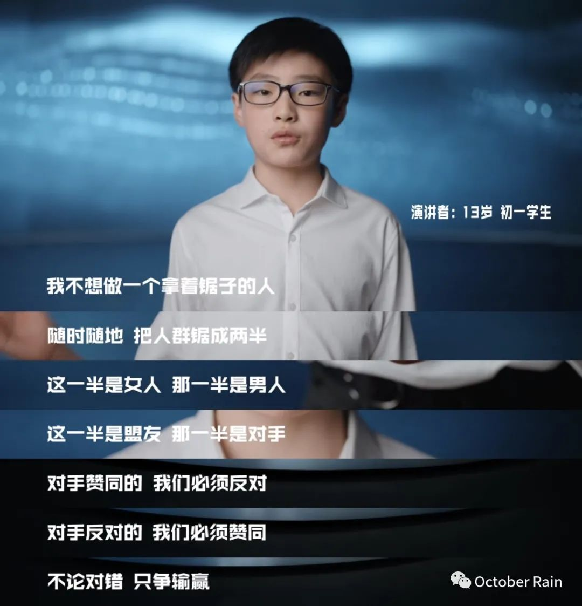
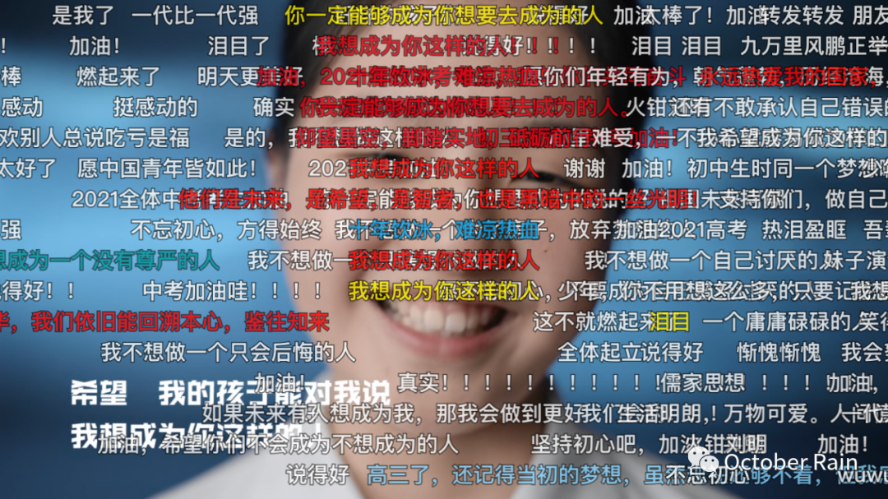

你好哇，我是十雨。

今天是五四青年节。

不知道你有没有看 b 站发布的关于五四青年节的主题演讲——《我不想做这样的人》，这个演讲从全国 955 名初中生的视角，描述了当下的青年们不想成为什么样的人。

说实在的，我很喜欢这个视频所传递的一些观点。

这些观点的确给我们一个看待事情不一样的角度。

而视频中的弹幕，视频下方的评论，也足以看出这段视频让青年人有多么热血沸腾。

但是等我看过视频，再细细思索的时候，我还是有一丝隐隐的担忧。

我在想，仅仅是明白 “我不想成为什么样的人” 就够了吗？

鲁迅先生说：愿中国青年都摆脱冷气，只是向上走，不必听自暴自弃者流的话。能做事的做事，能发声的发声。有一分热，发一分光，就令萤火一般，也可以在黑暗里发一点光，不必等候炬火。

鲁迅先生这段话不知道激励了多少中国青年，甚至我们每每看到这句话，就不由得心旌荡漾。

这是我们的理想，是吾辈青年希望做到的样子，可是现实是什么样子呢？

现实是：走向社会的青年们，在生活的重压下喘不过气来。

现实是：最近两年也许没有哪个学术用语比“内卷”更加出圈，随着网络上的广泛传播，“内卷”一词越来越被大众化，随之而来的便是“万物可卷”的时代。

现实是：面对高考，大家说太卷了；面对考研，大家说太卷了；面对求职，大家说太卷了。什么是当代青年的现状？这就是现状，一个 “万物可卷” 的现状。

老实说，我很不喜欢“内卷”这个词。因为从根本上，我觉得奋斗和努力不应该是过错，但是如果一个社会诸如“奋斗逼”、“内卷王”等形容词层出不穷的时候，我觉得，该从别的地方找一找问题。

我在想，仅仅是明白 “我不想成为什么样的人” 就够了吗？

视频里的 955 位青年，都是 15 岁左右的年纪，他们充满朝气，生机蓬勃，是青年中的新生力量，他们可以说：“其实我还不知道，想成为什么样的人。”

可是随着时间的推移呢？等他们步入大学需要选择一门专业的时候，等他们步入社会需要选择一项职业的时候，等他们成为二十多岁的青年，等他们成为一个成年人的时候呢？如果仅仅是 “我不想成为什么样的人” ，会发生什么呢？

他们大抵会想：“我不想成为一个前途无望的人，我不想成为一个没有人生追求的人，我不想成为一个失败的人。”

而对于大多数不知道 “自己想成为什么样的人” 的人来说，该如何界定成功与失败呢？

大概就等于选择大部分人都会选择的路，那条看上去最万无一失的路，然后努力地疯狂地内卷，最后做大多数人眼里的成功者吧？这种成功，或关乎名誉，或关乎权利，或关乎财富，唯独不关乎本心。

他们选择的这条路，或许是老师建议的，或许是父母亲人建议的，或许是网络上的陌生人建议的，但唯独不是自己内心的想法。

内卷从何而来？内卷从这里来。当每个人都想做别人眼里的成功者时，内卷应运而生。

内卷本质是什么呢？内卷的本质是没有创新，是低复杂的重复化。蛋糕只有那么大，而你仅仅是人云亦云，那么面对的势必是不断的相互挤压，内卷。

竞争和攀比，几乎就像七情六欲一样刻进人类的本能。即使在最简单问题面前，理性也会输给熊熊燃烧的比较之心。

热衷于“内卷”的人，或多或少都是把“他人”当作锚定物，而非自己心中的目标，理想，更何况一个 “我还不知道想成为什么样的人” 的人。

我没有说这个视频是错的，相反视频里的观点我很赞同。但是我觉得，该做梦的年纪，可以做梦，但是如果过了做梦的年纪，静下心来好好想一想“我想成为什么样的人”才是真。

在上一次的文章里我提过，一个人有三件事要做：需要做的，能够做的，想要做的。前两个是因，第三个才是果，如果你没有想要做的事，那你又想结什么样的果呢？

那么你觉得，仅仅是明白“我不想成为什么样的人”就够了吗？你又想成为什么样的人呢？

### BY THE WAY

这个视频是站在十五岁孩子的角度说：“其实我还不知道，我想成为什么样的人。” 的确，青年人的迷茫是无可厚非的，不明白自己要成为什么样的人也是正常的。同时，视频中也没有鼓吹说：我们不需要找到自己想成为什么样的人。

因此，我写这篇文章的目的也并非批判这个视频，而是希望提醒各位，“努力找到自己想要成为什么样的人” 这件事是重要的，是可以避免一个人陷入内卷的困境的。

关于我想要成为什么样的人，我觉得这个想法不一定非要很伟大。如果你有远大的理想固然好，但是如果没有，那也不必强求，很多人的想法只是希望岁月静好，那能够拥有一室、两人、三餐、四季，也是极佳的。

不管想成为什么样的人，努力完成自己的心中所想，努力成为自己想成为之人，才是最重要的。

最后，请你听从你内心的声音。这篇文章也只是一个迷茫青年的上下求索而已。
