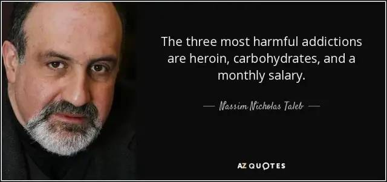

你好哇，我是十雨。好久不见啦～

最近实在是有些懈怠，本来说好一个月写一篇文章，慢慢运营自己的公众号，但是最近不但输出停滞了，输入也停滞了，已经很久没有留出大段空闲时间读书了，罪过罪过，但这最近的懈怠也让我萌生了写这篇文章的想法。

今天写这篇文章的起因，其实有两个：一是最近读到的一段话让我有醍醐灌顶之感；二是看到一些同龄人的做法对我最近的懈怠产生了极大冲击。

最近读到《反脆弱》作者纳西姆·尼古拉斯·塔勒布的一段话：**The three most harmful addictions are heroin, carbohydrates, and a monthly salary.（最有害的三种瘾，毒品，碳水，月薪。）**

这里先提一下塔勒布这位顶级大佬的履历，他连续成功预测了 1987 黑色星期一、911 事件、08 年次贷危机，并在每次预测前做空股市，直接让自己跻身亿万富翁之列。他提出著名的理论「黑天鹅」：指非常难以预测，且不寻常的事件，通常会引起市场连锁负面反应甚至颠覆。

那塔勒布上面的这段话的意义是什么，为何让我有醍醐灌顶之感呢？

在我看来，毒品和碳水其实是对自控力的束缚，毒品和碳水的瘾，会让我们意志消沉，精神和肉体遭到双重打击。（在我看来是对自律的极大挑战）

而关于第三点月薪，这就要提及《反脆弱》这本书，塔勒布认为，反脆弱的第一大敌人就是稳定，而这句话里的月薪实际上就是稳定的代名词。

我们可以想象，如果一个人长期生活两点一线，工作按部就班。那么他的思维势必会模式化，会陷入简单事情重复化的过程，这会让他陷入一个稳定的状态——拥有一份稳定的工作，给他带来一份稳定收入，同时也在慢慢杀死他的创新能力和学习能力。最可怕的是，这种稳定是让人们所向往的、上瘾的。

为了打败稳定这个敌人，塔勒布曾在《黑天鹅》中提出过“杠铃策略” ——90% 的资金进行稳健投资，而 10%资金用于高风险高收益投资，以此博取更高的收益。

其实这一策略可以被运用到各个地方。比如你可以干着一份稳定的本职工作，但又进行有较高回报、常伴随波动甚至无法短期看到收益的事宜，譬如投资、运营自媒体、坚持读书、坚持健身、学习新的技能等等。

而这里说到的高波动高收益短期无回报的事情，其实也是我标题中所提及的“第二种职业”。而在我看来，这个“第二种职业”，才是提高你核心竞争力的真正源泉。

我一直对这种“杠铃策略”有所实践，对我来说，我坚持学习投资、运营公众号、读书就是我的“第二种职业”。但是从目前我的更新频率来看，我的“第二种职业”属实做的很差劲。

由此也引出了我今天写这篇文章的第二个原因。同龄人是怎么做的？为什么对我造成了极大冲击？

我认识的一些同龄人，有现实生活中结识的、也有网络上默默关注很久的，同样的都是二十多岁，但他们已经坚持自己的“第二种职业”很久了，大部分已经度过了短期无收益的阶段。就用运营自媒体这件事来举例，他们最多的可以做到日更，而最少的也能做到一周三更，其中更有甚者 28 岁已经依靠“第二份职业”在北京买了房子。

这件事对我最大的冲击在于：我同样意识到“杠铃策略”的重要性（他们甚至可能都不知道自己在践行这个策略），为什么我没做到？我同样也在进行实践，为何我的成果却要比别人差很多？

我思考了很久，我认为区别就在懈怠和自律这两个词上，我也曾经定下过计划，要多久写一篇新的文章，但是并没有足够的意志力让我坚持下去，我陷入了懈怠的深渊，而我的这些同龄人们，凭借着自己的自律坚持了下去，并且一步一个脚印走出了一个好的结果。

懈怠和自律其实往往在一念之间，那到底什么才是影响这一念之间的关键呢？

我认为，自律的这个“自”，指的是自己的本能，而不是自己的意志，一个人的意志有有限的，而本能是无限的。如果你没有坚持下去一件你觉得重要的事情，这其实说明就你是在靠意志去支撑，而非本能驱动。

或者换个更直白的说法：你其实并不知道这件事到底有多重要，你不知道自己有多想要拥有它。

理清这个逻辑之后，其实一切都豁然开朗，为什么有些人能在自己的“第二种职业”上不断坚持？因为在他们心目中这个观点和他们的核心诉求直接挂钩，他们深刻明白这件事对自己多么重要。他们驯服了自己的本能，所以他们能做到知行合一。

关于驯服本能和知行合一这个问题，还可以从很多方面去讲。譬如从脑科学视角去看，驯服本能其实是一个人类脑驯服哺乳脑的过程。（这方面以后有机会再写文章）

聊完了问题产生的原因，那该如何解决呢？

我说三点自己的想法，不一定对，因为我也还需要实践：

1. *确定自己的核心诉求（目的是什么，建立本能）*
2. *确定自己阻碍自己主要障碍（需要解决什么问题）*
3. *确定一个规划（确保“第二份职业”的执行）*

上面这三点其实说的很简单，如果展开了聊。可以聊到如何确立自己的核心诉求、该如何制定规划、制定规划本身是否也是一种“稳定”等等，这些问题可以留给大家自己想一想，之后有空了我也可以写几篇文章聊聊自己的看法～

### BY THE WAY

人生不是数学题，不会有唯一解。

*最后，请你听从你内心的声音。这篇文章也只是一个迷茫青年的上下求索而已。*
