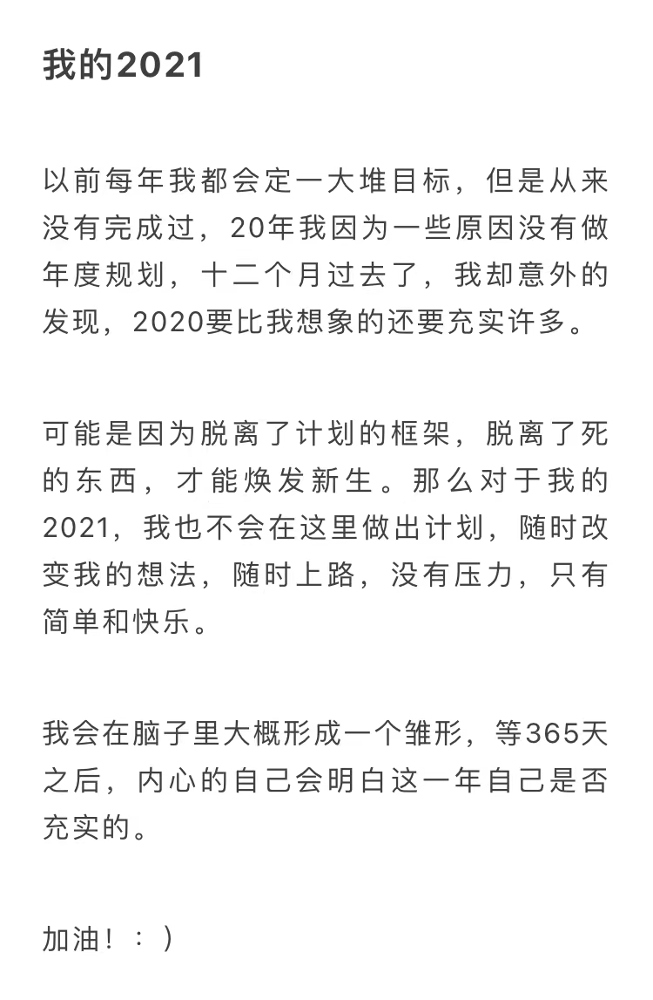

> “ 我戴上耳机，十月的雨水滴落在耳边，伴随而来的是柴火燃烧的爆裂声。 ”

## 重新听雨

你好呀，我是十雨。好久不见。

常用的汉字有 3500，让猴子坐在打字机前敲键盘，总有一天它会打出《莎士比亚全集》。可我没有“总有一天”，只有今夜。再怎么写，我也没法把 2021 完整的描绘给大家，好在我不需要描绘，写给自己就好，因为这是“我的课题”。

一年前的现在，我郑重地写下我的 2020，我在武汉；一年后的现在，我继续书写我的 2021，而我在杭州。真像是一次穿越时空的对话，我的面前不是文字，是一年前的自己。

hi，十雨，你好吗？

时间过的真快，2020 年的你还在感慨：一场疫情，2020 就结束了。可是转眼间，2021 就要离开了。

在 2020 的结尾你说：不要用计划去局限自己，脱离计划的框架，拥抱无限的可能。

2021 年的我说：你的确没有用整年的计划去局限自己，甚至你忘记了自己大致的计划，但是你走的每一步，做的每一个选择都收集了足够的信息，结果还让人满意。

## 我的 2021

如果 2020 的关键词是痛苦，那 2021 的关键词应该是分化。

今年的你面临了太多的抉择，也见过太多人做出抉择。

关于大众意义上的前途，今年的你运气真的很不错，在工作和保研上都有所收获。

尤其是工作，从刚开始什么都不懂慢慢学习，到懵懵懂懂的面试，再拿到最终的结果，你用了八个月的时间。回过头去看这八个月，你走了很多弯路，但是终究是迈了过来。

关于读书，今年的你真的十分差劲，只读了二十多本，比去年心里的目标少了整整一半，甚至不如去年八个月 30 本的成果。

不过好在你找到了自己最喜欢的书籍类目，商业传记。希望你在新的一年里能坚持自己喜欢的，至少读 20 本这一类的书～

关于投资，你在股市上遭受了毒打，但是令我欣慰的时候，你依然坚持了自己的逻辑，有时候最可怕的不是亏钱，而是被人性所打败。

关于自媒体，你应该已经羞愧到无地自容才对，公众号一年更新了四篇文章，在视频自媒体更是毫无参与，只希望你 2022 好自为之！

不过好消息是，你写的文章影响到一些朋友，让他们的人生轨迹有了些许改变，这或许能激励你 2022 更好的输出。

关于人生规划，很幸运，目前看来，每一步都是脚踏实地，每一次都是稳步前行。希望你能保持不断的思考，保持变化，拥抱变革。

去年的你，因为尼采而思考自己为什么而活。今年的你和去年一样，答案依旧模糊，但依旧全力以赴。

我没法用华丽的语言去描述你的 2021，因为它本就平淡，但你作为亲历者，看到这些肯定会有自己独特的感受。因为这是 “你的课题”。

不知去年的你对今年的你是否还算满意。

## 我的 2022

如果说 2020 是五味杂陈的夹心饼干，那 2021 可能是意犹未尽的黑巧克力。那么 2022 年我又会从人生的巧克力里拿到什么味道呢？

明年的这个时候，你已经正式工作了，你的感受是如何的？成长又如何呢？你读了哪些书，赚了多少钱，是否又有新的体悟和答案？

我对这一切都充满了好奇，可是在明年到来之前，我们永远不知道巧克力是什么味道。

明年的我，又会在哪里书写我的 2022 呢？真是让人期待，新年快乐，晚安。

## BY THE WAY

一年结束，按理说是应该好好总结一下，可是今天的文章写了很久也感觉乱乱的。今年干了很多事情，但是似乎没有完全串起来，理清楚。只好用最近读的书里提到的概念做个暂时的线。

课题的概念来自阿德勒心理学中提出的 "课题分离"。

阿德勒认为：一切人际关系矛盾都起因于对别人的课题妄加干涉或者自己的课题被别人妄加干涉。只要能够进行课题分离，人际关系就会发生巨大改变。

而辨别究竟是谁的课题的方法非常简单，只需要考虑一下 "某种选择所带来的结果最终要由谁来承担？"

一年的年终总结究竟意味着什么呢？年终总结到底是写给自己看的，还是写给朋友圈看的？我们在写年终总结的时候，是否夹杂着一种复杂的“优越情结”呢？

具体是哪里出了问题，我还没想清楚，不过有课题这根线，应该很快会有个结果。希望今年能多写几篇文章，多讲讲自己的想法吧。
