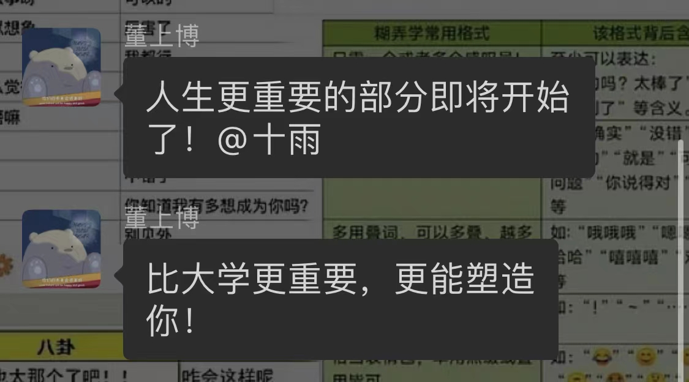

我想书写苦难，想一气呵成。可是没有苦难，没有一气呵成，没有快意，只有人生。

人生五年。

## 一、起

高考是人生最重要的一场考试，这是别人认为的。

五年前6.7号晚上看琅琊榜消遣的男孩从未这样想过。

他高中最喜欢的一句话说：“你选了一条违背主流的道路，就必须要付出非常大的代价，才能获得主流的认可”。

这句话，他到现在都记得。他从未后悔。

五年前6.7日下午四点十分，他写下填空题最后一题的答案，平静的抬头看了看时钟，还有五十分钟，他缓缓地下笔，一笔一划，波澜不惊，时间平淡的走过，就这么结束了。

18岁的七月，没有肆意的狂欢，平淡的不像盛夏。虽然收到录取通知书的那一刻，他的心还是抽搐了那么一下。

## 二、往

他想了很久没有动笔。这五年的一点一滴，这个又爱又恨的地方，这些已经离开或终将离开的人，他想了一遍又一遍。

他的记忆好像从来没有这么清晰过。

高等数学板书飞扬神采奕奕的老师，普通化学人生经历无穷的厂长，背着1米2丁字尺狂奔的工图少年，面面相觑四顾无言的线代考试，永不熄灯永远怀念的升升412，办公部每周的忙碌与愉快，摄影部一起送报纸的点滴日常，早八和晚十的南湖图书馆，为是否离开土建而纠结的日日夜夜，还有那个在校运会认识的永远的小孩子。这是他的大学一年级，热情。

提交降级申请时别人的不理解，1218认识的大学最好的女生朋友，迎新时给“学弟”们发自内心的建议，厚着脸皮和“学长”们住在一起的日子，支付宝首页的纳斯达克和招商白酒，热烈而短暂但没有遗憾的恋爱，陪他度过漫长岁月的mbp2018，还有偷偷摸摸组装的第一台电脑，以及坐在最后一排看着第一排座位的感慨万千。这是他的大学二年级，分岔。

那些痛苦而黑暗的日子，那些人性最深处的考验，那些无能的不甘狂怒，新冠疫情肆虐武汉时的煎熬，为自己的警觉和谨慎而庆幸万分，那些和老朋友相处的日子，见证历史美股熔断的黑色三月，相信书中有永恒的四月，看到朋友实习offer时的羡慕与自卑。这是他的大学三年级，痛苦。

早八晚十的脚踏实地，被雷鸣冬日狂风十月雨治愈的分秒，I栋和C栋的午饭晚饭之约，看到十一点起床考研党时的恨铁不成钢，东门外三人份的扬州炒饭，茶余饭后的三两散步，替朋友前程担心的每分每秒，朋友在南湖旧食堂的无声痛哭，以及那篇《我们到底该如何做出选择？》，工作还是读研的纠结，拒绝美团offer时的尴尬，收到蚂蚁offer的喜悦。这是他的大学四年级，努力。

他的第四个大学寝室他的保龄协会，那个经常闷闷不乐不喜交流的傻逼，还有杀死一个行业的双减政策，人人得而诛之的互联网反垄断，阴霾重重的股票市场，焦虑万分又十分开心的实习期，充满奇幻的北京之旅，想成为一个up的冲动，对自身缺点的肤浅认知，对未来不确定性的担忧，对这五年经历的惆怅和迷思。这是他的大学五年级，冲击。

他敲下这些回忆，重新怀念这五年时光，嘴角上扬。他心想，没有遗憾。虽然如果重新来过，他会做的更好。

五年前他三个人来，带着失意的愤恨和少年的热血来；五年后他一个人走，带着矛盾的爱恨和满腔的憧憬走。

## 三、来

昨天，6.7号，答辩结束，五年过去，依旧平淡，依旧只有24小时，不多一分，不少一秒。没有任何特别。

他很喜欢看《一起同过窗》，里面的每次别离都令人伤感，终于到了自己要走的时候，那天会是什么感觉呢？

姐姐和他讲：人生最重要的部分即将开始。

往者不可谏，来者犹可追。下个五年会是什么样呢？自己又想被塑造成什么样的人？他暗暗问自己。

28岁的今天，会比现在更好吗？会被塑造成一个更美好、更善良、更明朗、更坚定、更少年的人吗？

他期待这天，正如我期待这天一样。

他轻声说，别忘记自己的梦。

## 四、终

五点了，收卷，结束，尘埃落定。

五年前的晚上，他通宵看完了《余罪》，今天他看《The Boys》。

五年前他最喜欢的歌是《new boy》，今天依旧是。

五年过去，五年过来。他说，下次见。

毕业快乐，祝，永远在路上。

谨以此文纪念“他”的人生五年。谁知道五年后的28岁他，又是怎么样的少年呢？