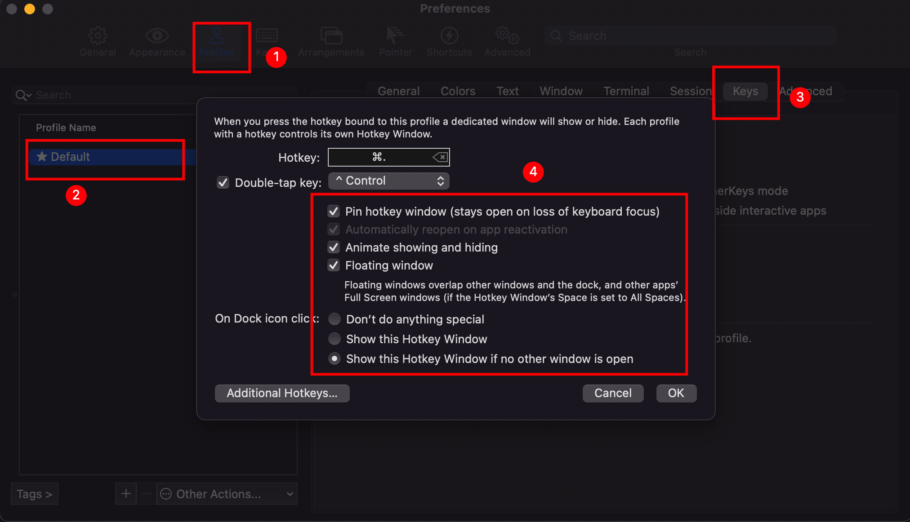

## 配置 iterm2



## 配置 oh my zsh

参考[Oh My Zsh + PowerLevel10k = 😎 terminal](https://dev.to/abdfnx/oh-my-zsh-powerlevel10k-cool-terminal-1no0)

### 下载 powerlevel10k 主题

[参考知乎此文](https://zhuanlan.zhihu.com/p/265525597)

install-alinode

`control + a` 跳到行头

`control + e` 跳到行尾

`control + w` 删除前一个单词

`control + u` 删除当前行

`control + l` 清屏

## ls 的 替代品

`lsd` `exa`, 我这次选择的是 `lsd`。

在 `~/.zshrc` 中的配置为:

```sh
if [ -x "$(command -v lsd)" ]; then
    alias ls="lsd"
    # alias la="exa --long --all"
fi
```
