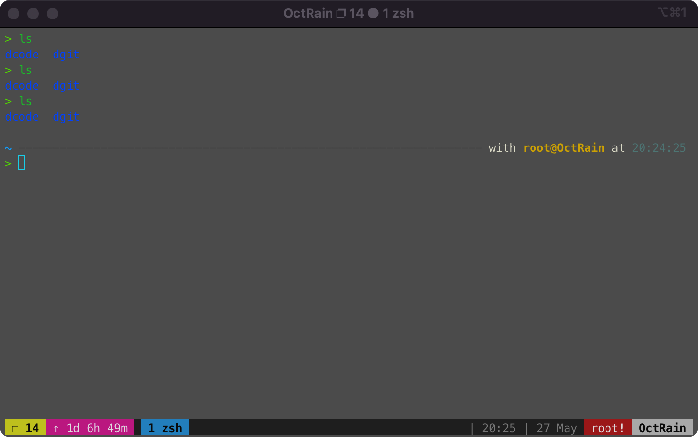

## tmux 安装

使用 `yum` 安装的版本过于古早，就不再演示。

### 源码编译安装

下面使用源码进行安装，具体可以[参考](https://github.com/tmux/tmux)

```sh
# 安装软件依赖
$ yum install -y gcc automake libevent-devel ncurses-devel glibc-static

# 下载源代码
$ git clone git@github.com:tmux/tmux.git

# 切换到 2.8 版本
$ cd tmux
$ git checkout 3.2

# 编译源码
$ sh autogen.sh && ./configure && make

# 查看版本号
$ ./tmux -V
tmux 2.8

# 删除安装包
$ cd ..
$ rm -rf tmux
```

### 自动化安装

## 配置

### 使用 zsh

`tmux` 默认使用的 `bash`，我们想使用 `zsh`。

```sh
vim ~/.tmux.conf

# 添加下面两行
set -g default-shell /usr/local/bin/zsh # /usr/local/bin/zsh 路径可能会有不同
set -g default-command /usr/local/bin/zsh

# 运行下面 使之生效
tmux source-file ~/.tmux.conf
```

### 使用 oh my tmux 配置

参考github项目 [ohmytmux](https://github.com/gpakosz/.tmux)

```sh
$ cd
$ git clone https://github.com/gpakosz/.tmux.git
$ ln -s -f .tmux/.tmux.conf
$ cp .tmux/.tmux.conf.local .
```

不知道为什么，我配出来和预期不符



## 使用

[shanyue教程](https://shanyue.tech/op/tmux-setting.html#%E5%BF%AB%E9%80%9F%E5%BC%80%E5%A7%8B)

[PegasusWang视频教程](https://www.bilibili.com/video/BV1Qq4y1f7N1)