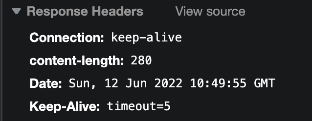

## 什么是静态资源服务器？

### 静态资源

它指的是**不会被服务器的动态运行所改变或者生成的文件**。它最初在服务器运行之前是什么样子, 到服务器结束运行时, 它还是那个样子。比如平时写的 `js`, `css`, `html` 文件, 都可以算是静态资源。


### 静态资源服务器

静态资源服务器就是向客户端提供静态资源的一个程序。

他可以监听对应的端口，当用户访问这个端口号时，将静态资源返回给用户。


### 最常见的静态资源服务器有哪些？怎么使用？

最常见的静态资源服务器有 `serve`、`http-server`等。

`serve` 的使用方法如下。

```sh
# Usage
$ serve folder_name
$ serve [-l listen_uri [-l ...]] [directory]

# 默认
By default, serve will listen on 0.0.0.0:3000 and serve the current working directory on that address.
```

它会 serve 对应的工作目录到对应端口号上。例如， `npx serve .`，将当前工作目录，serve 到 默认的 3000 端口上。

其他用法详见 `npx serve --help`

## 手写简单的静态资源服务器

接下来，我们将要把下面这段代码，部署到本地 3000 端口上。

```html
<!DOCTYPE html>
<html lang="en">
<head>
  <meta charset="UTF-8">
  <meta http-equiv="X-UA-Compatible" content="IE=edge">
  <meta name="viewport" content="width=device-width, initial-scale=1.0">
  <title>front end deploy</title>
</head>
<body>
  hello OctoberRain ~
</body>
</html>
```

注意：部署成功的定义是什么？

当我们对指定端口号进行访问时候，`http` 请求的响应体中能够返回我们需要的静态资源，那我们就部署成功了。

### 响应字符串

```js
const http = require('node:http')
const fs = require('node:fs')

const dataStr = `
<!DOCTYPE html>
<html lang="en">
<head>
  <meta charset="UTF-8">
  <meta http-equiv="X-UA-Compatible" content="IE=edge">
  <meta name="viewport" content="width=device-width, initial-scale=1.0">
  <title>front end deploy</title>
</head>
<body>
  hello OctoberRain ~
</body>
</html>
`

const server = http.createServer((req, res) => res.end(dataStr))

server.listen(3000, () => {
  console.log('正在监听 3000 端口')
})

```

查看控制台网络，可以看到 


`Content-Length`是 282，这是因为 `dataStr` 里有两个多余的换行符。

### 响应文件

使用字符串的方式太过繁琐，我们如何才能读取文件呢？可以使用 `node:fs`

```js
const http = require('node:http')
const fs = require('node:fs')

const server = http.createServer((req, res) => {
  const html = fs.readFileSync('./index.html')
  res.end(html)
})

server.listen(3000, () => {
  console.log('正在监听 3000 端口')
})
```

查看控制台网络，可以看到 


可以看到 `Content-Length` 是 280，不存在两个换行符了。

### 基于 stream 读取文件

从性能出发，将文件系统修改为 ReadStream 的形式进行响应将会提升该静态服务器的性能。

```js
const http = require('node:http')
const fs = require('node:fs')

// req 是请求体
// res 是响应体
const server = http.createServer(async (req, res) => {

  fs.createReadStream('./index.html').pipe(res)
})

server.listen(3000, () => {
  console.log('正在监听 3000 端口')
})
```

查看控制台网络，可以看到 `Transfer-encoding` 是 `chunked`，同时没有了 `content-length`


因此我们要对 `content-length` 重新进行设置。

```js
const http = require('node:http')
const fs = require('node:fs')
const fsp = require('node:fs/promises')

const server = http.createServer(async (req, res) => {
  const stat = await fsp.stat('./index.html')
  console.log('stat', stat)
  
  res.setHeader('content-length', stat.size)
  fs.createReadStream('./index.html').pipe(res)
})

server.listen(3000, () => {
  console.log('正在监听 3000 端口')
})
```

查看控制台网络，可以看到 `content-length` 已经成功设置了。



## 总结

目前我们实现了一个最简单的静态资源服务器，接下来我们要实现一个功能完备的静态资源服务器。