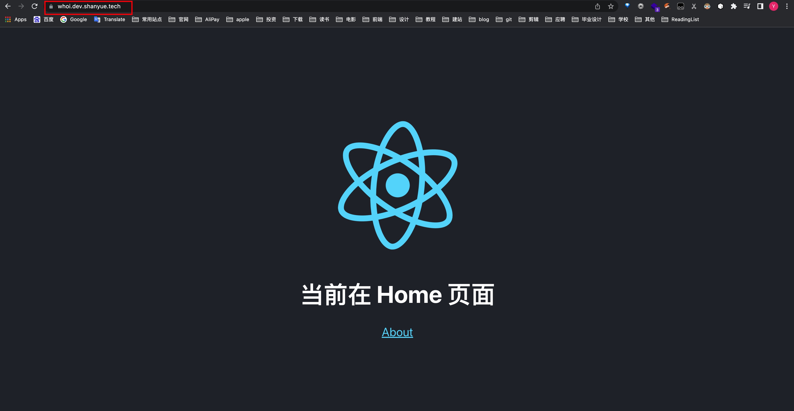

本文比较简单，参考山月老师[这篇文章](https://q.shanyue.tech/deploy/traefik-domain.html)。（后面有空在总结吧）

需要注意就是，需要把前端项目和 `traefik` 网络同时放到服务器上，并且和上篇文章一样，先用 `docker-compose up -d` 启动 `traefik`，然后 `docker-compose -f domain.docker-compose.yaml up domain` 启动项目的容器（容器里配置了使用哪个网络，使用哪个域名）。

效果见下图。

