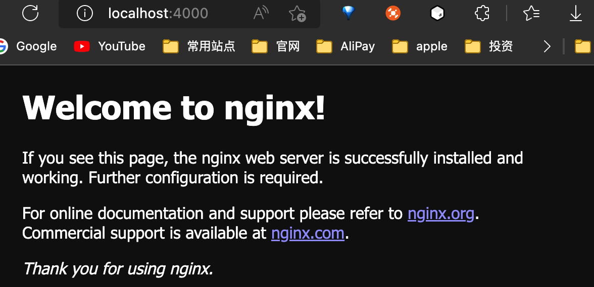
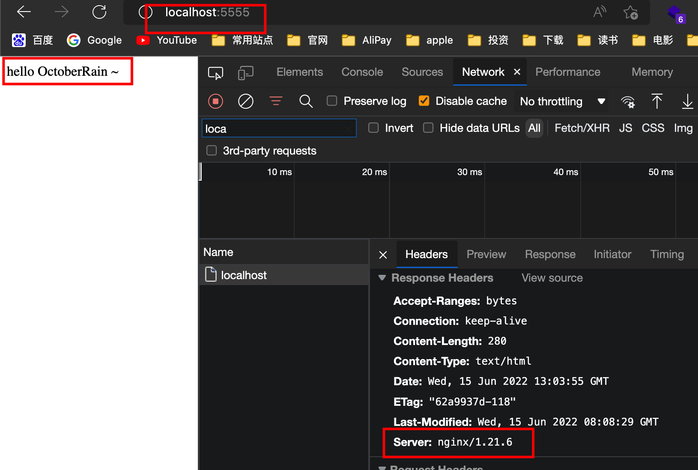

## 为什么使用 nginx

对于仅仅提供静态资源服务的前端，实际上是不必将 `nodejs` 作为运行环境的。在实际生产经验中，一般选择体积更小，性能更好，基于 `nginx` 的镜像。

我们通过 `docker images` 查看镜像体积，发现 `node:alpine` 体积是 `nginx:alpine` 的数倍大小。

```js
$ docker images nginx
REPOSITORY   TAG       IMAGE ID       CREATED        SIZE
nginx        alpine    b46db85084b8   6 months ago   23.2MB

$ docker images node
REPOSITORY   TAG         IMAGE ID       CREATED        SIZE
node         alpine      025c3cbb849f   4 months ago   169MB
```

## nginx 学习

### 使用 docker 学习 nginx

我们可以通过 `docker` 来模拟 `linux` 环境，学习 `nginx`。

通过以下一行命令可进入 `nginx` 的环境当中，并且了解 `nginx` 的目录配置，该命令同样可以使用在其他镜像上。

```sh
# 进入到 nginx 容器中， -i -t 可以缩写为 -it
docker run -i -t --rm nginx:alpine sh

# 进入容器中，在容器中可通过 exit 退出容器环境
exit
```

通过以下一行命令可直接访问 `nginx` 的默认页面

```sh
# -p 4000:80，在本地 4000 端口访问 nginx 页面
docker run -it --rm -p 4000:80 nginx:alpine
```



### 从 nginx 镜像默认配置，了解极简部署方法

根据上文的命令 `docker run -i -t --rm nginx:alpine sh` 进入虚拟终端后，就可以进行进行相关的学习了。

默认配置文件位于 `/etc/nginx/conf.d/default.conf`，通过 `cat` 可查看配置。

```sh
cat /etc/nginx/conf.d/default.conf

server {
    listen       80;
    server_name  localhost;

    #access_log  /var/log/nginx/host.access.log  main;

    location / {
        root   /usr/share/nginx/html;
        index  index.html index.htm;
    }

    #error_page  404              /404.html;

    # redirect server error pages to the static page /50x.html
    #
    error_page   500 502 503 504  /50x.html;
    location = /50x.html {
        root   /usr/share/nginx/html;
    }

    # proxy the PHP scripts to Apache listening on 127.0.0.1:80
    #
    #location ~ \.php$ {
    #    proxy_pass   http://127.0.0.1;
    #}

    # pass the PHP scripts to FastCGI server listening on 127.0.0.1:9000
    #
    #location ~ \.php$ {
    #    root           html;
    #    fastcgi_pass   127.0.0.1:9000;
    #    fastcgi_index  index.php;
    #    fastcgi_param  SCRIPT_FILENAME  /scripts$fastcgi_script_name;
    #    include        fastcgi_params;
    #}

    # deny access to .htaccess files, if Apache's document root
    # concurs with nginx's one
    #
    #location ~ /\.ht {
    #    deny  all;
    #}
}
```

看到配置文件里有一个路径 `/usr/share/nginx/html`，我们进入这个路径查看一下

```sh
cd /usr/share/nginx/html

ls
50x.html    index.html
```

可以看到这个目录下，恰好有配置文件中提到的两个文件 `index.html`、`50x.html`。由此可知，该配置文件做了以下两个事情。

1. 监听本地 80 端口
2. 为 `/usr/share/nginx/html` 目录做静态资源服务

那我们将我们的示例资源添加到镜像中的 `/usr/share/nginx/html` 岂不可以正确部署了？

那我们将我们的配置文件添加到镜像中的 `/usr/share/nginx/html` 岂不可以学习 `nginx` 的一些指令了。

正是如此。

### nginx 配置学习

[参考shanyue老师](https://q.shanyue.tech/deploy/nginx.html)

占坑

## 使用 nginx 镜像进行部署

编写一个 `nginx.Dockerfile` 

```ts
FROM nginx:alpine

ADD index.html /usr/share/nginx/html/
```

并完成 `docker-compose.yaml` 文件。

```yaml
version: "3"
services:
  nginx-app:
    build:
      context: .
      dockerfile: nginx.Dockerfile
    ports:
      - 5555:80
```

执行 `docker-compose up --build nginx-app` 即可运行。

