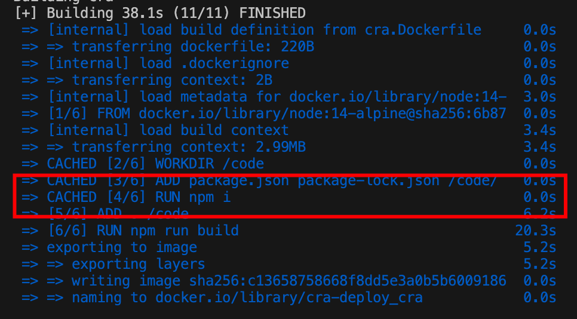
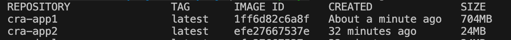

## 创建一个单页应用

使用下面的命令创建一个基于 `ts` 的 `cra` 应用

`npx create-react-app@latest cra-deploy --template typescript`

然后 `cd cra-deploy`，可以看到这个目录下有 `package.json` `package-lock.json`。

运行 `npm run build`，然后运行 `npx serve -s build -p 3333`

然后可以在 `http://localhost:3333` 访问该单页应用

## 创建 docker-compose 文件

接下来我们都使用 `docker-compose` 进行构建，因此我们可以先创建这个文件（有点 `TDD` 的味儿）

```yaml 
version: "3"
services:
  cra:
    build:
      context: .
      dockerfile: cra.Dockerfile 
    ports:
      - 3333:80
```

`ports` 前面的端口是宿主机端口，后面的80是容器暴露的端口号

## 创建 Dockerfile

### 简单 Dockerfile

```Dockerfile
FROM node:14-alpine

WORKDIR /code

ADD . /code
RUN npm i && npm run build 

CMD npx serve -s build -p 80
EXPOSE 80
```

执行 `docker-compose up --build cra`。可以看到构建完成，并可以访问。

然而还可以针对以下两点进行优化。
1. 构建镜像时间过长，优化构建时间。
2. 构建镜像文件过大，优化镜像体积。

### 构建时间优化

我们注意到，一个前端项目的耗时时间主要集中在两个命令：

1. `npm i`
2. `npm run build`

在本地环境中，如果没有新的 `npm package` 需要下载，不需要重新 `npm i`。

那 `Docker` 中是不也可以做到这一点？

在 `Dockerfile` 中，对于 `ADD` 指令（[官方文档]((https://docs.docker.com/engine/reference/builder/#add))）来讲，如果添加文件内容的 `checksum` 没有发生变化，则可以利用构建缓存（[`Best practices for writing Dockerfiles`](https://docs.docker.com/develop/develop-images/dockerfile_best-practices/#leverage-build-cache)）。

而对于前端项目而言，如果 `package.json/package-lock.json` 文件内容没有变更，则无需再次 `npm i`。

将 `package.json/package-lock.json` 事先置于镜像中，安装依赖将可以获得缓存的优化，优化如下。

```Dockerfile
FROM node:14-alpine

WORKDIR /code

ADD package.json package-lock.json /code/
RUN npm i

ADD . /code 
RUN npm run build

CMD npx serve -s build -p 80
EXPOSE 80
```

优化后再次执行，可以看到每次构建都会进行 `cached`，如果 `lock` 文件没有更新，则不会执行 `npm i`



构建时间缩减了 60s。

### 构建体积优化

我们的目标是提供静态服务（资源），完全不需要依赖于 node.js 环境进行服务化。node.js 环境在完成构建后即完成了它的使命，它的继续存在会造成极大的资源浪费。

我们可以使用多阶段构建进行优化，最终使用 nginx 进行服务化。
1. 第一阶段 Node 镜像：使用 node 镜像对单页应用进行构建，生成静态资源。
2. 第二阶段 Nginx 镜像：使用 nginx 镜像对单页应用的静态资源进行服务化。

```Dockerfile
FROM node:14-alpine AS cra-builder

WORKDIR /code

ADD package.json package-lock.json /code/

RUN npm i

ADD . /code
RUN npm run build 

FROM nginx:alpine
COPY --from=cra-builder /code/build /usr/share/nginx/html
```

再次运行，就可以看到两次优化后的构建的镜像启动后的页面啦～

使用`docker build -t cra-app1 . -f cra.Dockerfile` 和 `docker build -t cra-app2 . -f cra.Dockerfile` 分别构建后

执行 `docker images`，可以看到构建完成



如图可以看到体积优化十分明显。

## 思考题

为什么我们前端需要使用多阶段构建，多阶段构建还有什么场景？

