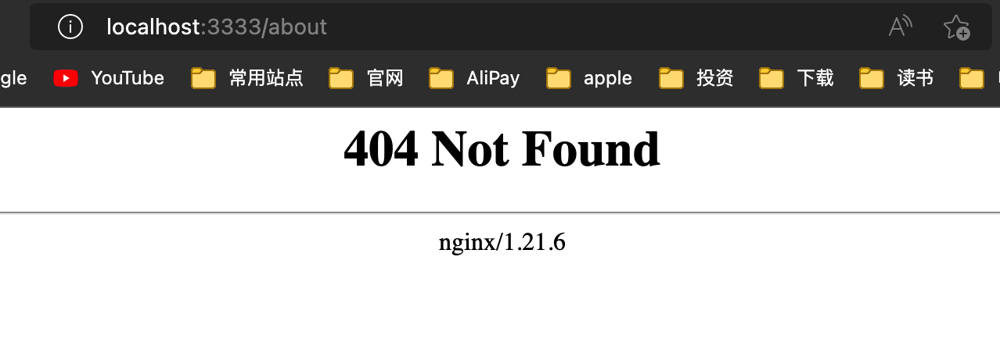

## 完成简单的路由

源码在这儿～(占坑)

```tsx
// app.tsx
import React from 'react';
import logo from './logo.svg';
import './App.css';
import { Routes, Route, Link } from 'react-router-dom';

function Home() {
  return (
    <div>
      <header className="App-header">
        
        <h1>当前在 Home 页面</h1>
        <Link to="/about" className="App-link">About</Link>
      </header>
    </div>
  )
}

function About() {
  return (
    <div>
      <header className="App-header">
        
        <h1>当前在 About 页面</h1>
        <Link to="/" className="App-link">Home</Link>
      </header>
    </div>
  )
}

function App() {
  return (
    <div className="App">
      <Routes>
        <Route path="/" element={<Home />} />
        <Route path="/about" element={<About />} />
      </Routes>
    </div>
  );
}

export default App;
```

```tsx
// index.tsx
...
root.render(
  <React.StrictMode>
    <BrowserRouter>
      <App />
    </BrowserRouter>
  </React.StrictMode>
);
```

执行 `pnpm run start` ，就可以看到已经可以成功运行，路由也完成了～

此时拥有两个路由:
1. `/`，首页
2. `/about`，关于页面

## 使用上节 docker-compose 进行部署

执行 `docker-compose up --build cra`，访问 `3333` 端口成功，但是直接访问 `http://localhost:3333/about`，回跳到 404 页面。



这是因为：在打包后的静态资源中并没有 `about` 或者 `about.html` 资源，因此返回 `404 Not Found`。而在单页应用中，`/about` 是由前端通过 `history API` 进行控制。

解决方法：在服务端将所有页面路由均指向 `index.html`，而单页应用再通过 `history API` 控制当前路由显示哪个页面。 这也是静态资源服务器的重写(`Rewrite`)功能。

我们在使用 `nginx` 镜像部署前端应用时，可通过挂载 `nginx` 配置解决该问题。见下文。

## 编写新的 Dockerfile 和 docker-compose

### Dockerfile

```Dockerfile
FROM node:14-alpine AS router-builder

WORKDIR /code

# 缓存优化
ADD package.json package-lock.json /code/
RUN npm i

# 可以把 ADD . /code 改写成下面的方式。
# 这样可以避免其他不必要的文件改变而导致缓存失效了。
ADD public /code/public
ADD src /code/src
ADD tsconfig.json /code/tsconfig.json
# 下面两种写法有问题
# ADD public src tsconfig.json /code
# ADD public /code/public && src /code/src && tsconfig.json /code/tsconfig.json

RUN npm run build

# 选择更小体积的基础镜像
FROM nginx:alpine
ADD nginx.conf /etc/nginx/conf.d/default.conf
COPY --from=router-builder code/build /usr/share/nginx/html
```

几个小问题：
1. 为什么不使用 `ADD . code/`，而要拆成三个命令？
2. 这样不会造成更多层的问题吗？
3. `ADD` 可以把多个命令用 `&&` 等方式写在一起吗？
4. `ADD nginx。conf ...` 这条命令为什么写在最后？

回答：
1. 可以避免其他不必要的文件改变而导致缓存失效了。比如不会引入 `build`、`node_modules` 这些文件。（或者可以使用 `.dockerignore` 文件）
2. 不会造成层数变多的问题，因为在最后我们进行了多阶段构建优化，前面的层全部会被移除。
3. 不行，具体看[官网 `ADD`](https://docs.docker.com/engine/reference/builder/#add)，`ADD` 只支持多个文件拷贝到同一个路径，如果是多个文件不同路径，需要写多条
4. 因为 `nginx` 的镜像在最后才被引入，如果在前面 `ADD` 则不会生效


### docker-compose

```yaml
version: "3"
services:
  router:
    build:
      context: .
      dockerfile: router.Dockerfile
    ports:
      - 4444:80
```

## 配置 nginx.conf 进行优化

### 路由的优化

使用 `nginx` 的 `try_files` 指令。

```conf
location / {
    # 如果资源不存在，则回退到 index.html
    try_files  $uri $uri/ /index.html;  
}
```

至此，上文遇到的 `http://localhost:3333/about` 无法访问的问题就解决了

### 长期缓存配置

在 `CRA` 应用中，`./build/static` 目录均由 `webpack` 构建产生，资源路径将会带有 `hash` 值。

```sh
tree ./build
./build
├── asset-manifest.json
├── favicon.ico
├── index.html
├── logo192.png
├── logo512.png
├── manifest.json
├── robots.txt
└── static
    ├── css
    │   ├── main.073c9b0a.css
    │   └── main.073c9b0a.css.map
    ├── js
    │   ├── 311.c7eed58b.chunk.js
    │   ├── 311.c7eed58b.chunk.js.map
    │   ├── main.445e6c79.js
    │   ├── main.445e6c79.js.LICENSE.txt
    │   └── main.445e6c79.js.map
    └── media
        └── logo.6ce24c58023cc2f8fd88fe9d219db6c6.svg

4 directories, 15 file
```

此时可通过 `expires` 对它们配置一年的长期缓存，它实际上是配置了 `Cache-Control: max-age=31536000` 的响应头。

那为什么带有 hash 的资源可设置长期缓存呢: **资源的内容发生变更，他将会生成全新的 hash 值，即全新的资源路径**，而旧有资源将不会进行访问。

`nginx` 配置如下：

```conf
location /static {
    expires 1y;
}
```

### 最终配置

```conf
server {
    listen       80;
    server_name  localhost;

    root   /usr/share/nginx/html;
    index  index.html index.htm;

    location / {
        # 解决单页应用服务端路由的问题
        try_files  $uri $uri/ /index.html;  

        # 非带 hash 的资源，需要配置 Cache-Control: no-cache，避免浏览器默认为强缓存
        expires -1;
    }

    location /static {
        # 带 hash 的资源，需要配置长期缓存
        expires 1y;
    }
}
```

## 改进点

在前端部署流程中，一些小小的配置能大幅度提升性能，列举一二，感兴趣的同学可进一步探索。

构建资源的优化:
1. 使用 terser 压缩 Javascript 资源
2. 使用 cssnano 压缩 CSS 资源
3. 使用 sharp/CDN 压缩 Image 资源或转化为 Webp
4. 使用 webpack 将小图片转化为 DataURI
5. 使用 webpack 进行更精细的分包，避免一行代码的改动使大量文件的缓存失效