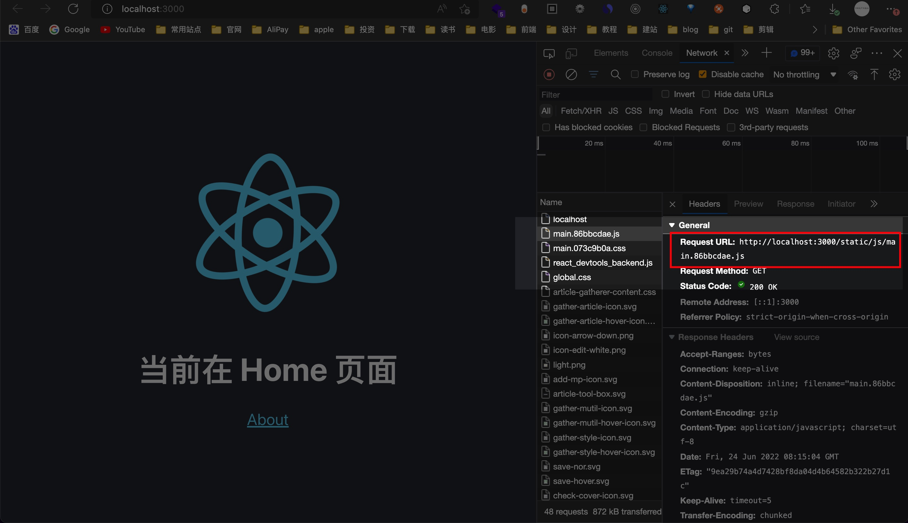
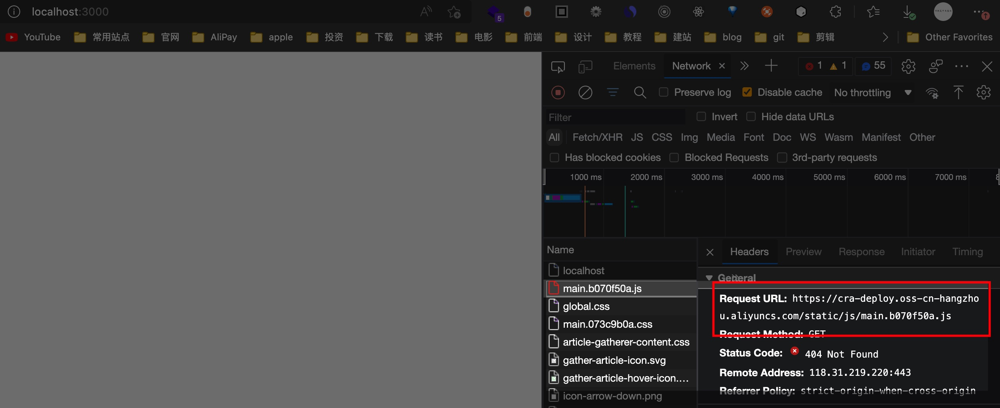
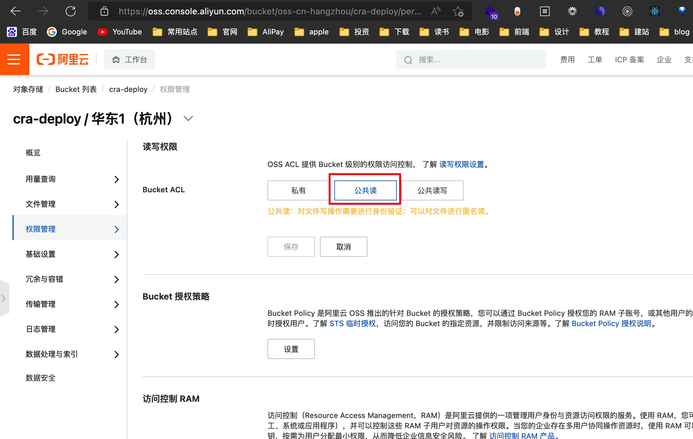
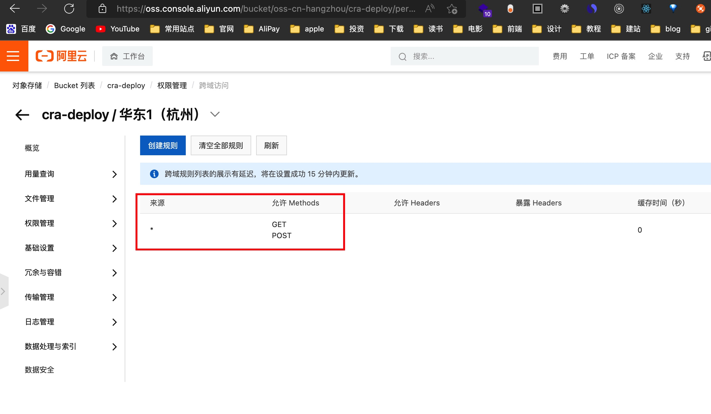
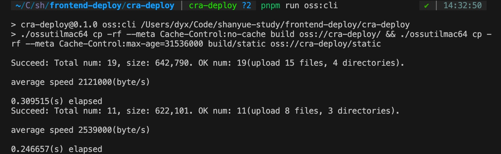
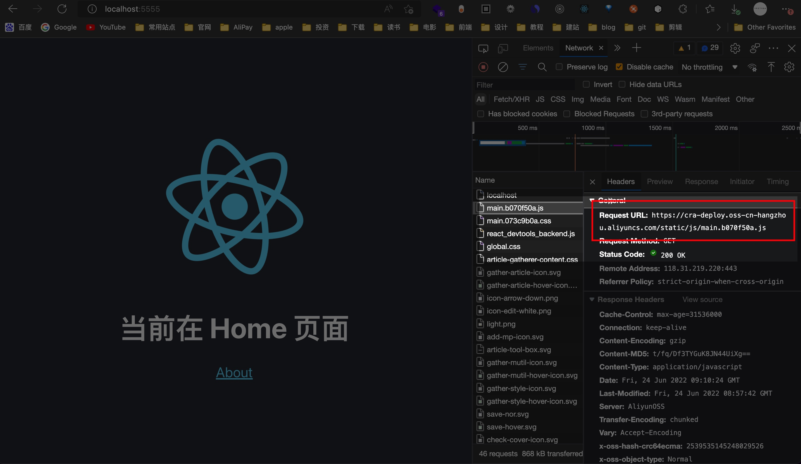

本篇文章，我们会学习如何将静态资源部署至 `OSS`(近乎等同于 `CDN`)，与大部分公司的生产环境一致。

注意：测试环境中建议无需上传至 `OSS`，毕竟上传至 `OSS` 需要额外的时间，且对于测试环境无太大意义。

## 如何访问 OSS 中的资源

在本地 `pnpm run build && npx serve -s build`，查看控制面板网络，可以看到如下图：静态资源的访问地址是本地。



在开始学习如何将静态资源上传到 `OSS` 之前，我们先思考一个问题，我们是如何做到让应用访问 `OSS` 上的静态资源的呢，而不是上图中的本地路径呢？

这个就涉及到 `webpack` 中的 `PUBLIC_PATH` 的配置，该配置能帮助你为项目中的所有资源指定一个基础路径，它被称为**公共路径**。

在 `cra` 应用中，我们无法直接配置 `webpack`，我们需要使用环境变量进行设置。

在 `Terminal` 中执行 `export PUBLIC_URL=https://cra-deploy.oss-cn-hangzhou.aliyuncs.com/` 即可（此路径会在下文获取）

再次执行 `pnpm run build && npx serve -s build`，查看可得下图：已经在访问以 `PUBLIC_PATH` 为基础路径的资源了，但是目前还没上传到 OSS



## 配置 OSS

本文使用阿里云 `OSS` 服务。

### 创建 AccessKey

参考[文档](https://help.aliyun.com/document_detail/53045.html)，进行 `aliyun_access_key_id`、`aliyun_access_key_secret`的配置

### 创建 Bucket

`Bucket`（桶） 是 `OSS` 中的存储空间。对于生产环境，可对每一个项目创建单独的 `Bucket`，而在测试环境，多个项目可共用 `Bucket`。

在创建 `Bucket` 时，需要注意以下事项。

1. 权限设置为公共读 (`Public Read`)
2. 跨域配置 `CORS` (`manifest.json` 需要配置 `cors`)
3. 记住 `Endpoint`，比如华东 1 区（杭州）是：`oss-cn-hangzhou.aliyuncs.com`。这个将会在配置 `PUBLIC_URL` 中使用到。`Endpoint`参考[访问域名和数据中心](https://help.aliyun.com/document_detail/31837.html)

下面是公共读的设置



下面是`cors`的设置



### 获得 PUBLIC_URL

最终的 `PUBLIC_URL` 为 `$Bucket.$Endpoint`，比如本篇文章示例项目的 `PUBLIC_URL` 为 `https://cra-deploy.oss-cn-hangzhou.aliyuncs.com/`。

但是，你也可以配置 `CNAME` 记录并使用自己的域名。

在以下命令行及代码示例中，我们将 `cra-deploy` 项目的静态资源全部上传至 `cra-deploy` 该 `Bucket` 中。

## 资源推送到 OSS

### 方法一：使用 ossutil

[ossutil 安装](https://help.aliyun.com/document_detail/120075.htm)

[ossutil 文档](https://help.aliyun.com/document_detail/50452.html)

在 x86 架构下的 mac 安装流程如下：

```sh
cd 当前cra-deploy项目目录

# 安装 ossutilmac64 到当前文件夹下
curl -o ossutilmac64 https://gosspublic.alicdn.com/ossutil/1.7.13/ossutilmac64

# 给这个文件可执行权限
chmod 755 ossutilmac64

# 进行配置，按要求输入即可
./ossutilmac64 config
```

注意：也可以通过下面的命令进行配置，在该命令中我将 `key`、`secret`、`endpoint` 使用环境变量进行维护，如果没有使用环境变量维护，请手动输入 `key`、`secret`、`endpoint`

```sh
export ACCESS_KEY_ID=xxxxxx
export ACCESS_KEY_SECRET=xxxxxx
export ENDPOINT=xxxxxx

./ossutilmac64 config -i $ACCESS_KEY_ID -k $ACCESS_KEY_SECRET -e $ENDPOINT
```

配置完成后，使用 `./ossutilmac64 cp` 即可将本地文件上传到 `OSS`，而缓存策略与前篇文章保持一致:

1. 带有 hash 的资源一年长期缓存
2. 非带 hash 的资源，需要配置 Cache-Control: no-cache，避免浏览器默认为强缓存

```sh
# 将本地目录 build 上传到 Bucket oss://cra-deploy 中
# --meta: 配置响应头，也就是这里的缓存策略
# build: 本地静态资源目录
# oss://cra-deploy/: bucket 名字
./ossutilmac64 cp -rf --meta Cache-Control:no-cache build oss://cra-deploy/

# 将带有 hash 资源上传到 OSS Bucket，并且配置长期缓存
# 注意此时 build/static 上传了两遍 (可通过脚本进行优化)
./ossutilmac64 cp -rf --meta Cache-Control:max-age=31536000 build/static oss://cra-deploy/static
```

为求方便，可将两条命令维护到 `npm scripts` 中

```json
  "scripts": {
    "oss:localhost": "./ossutilmac64 cp -rf --meta Cache-Control:no-cache build oss://cra-deploy/ && ./ossutilmac64 cp -rf --meta Cache-Control:max-age=31536000 build/static oss://cra-deploy/static"
  },
```

运行截图如下：



### 方法二：使用 ali-oss SDK

另有一种方法，通过官方提供的 `SDK`: [`ali-oss`](https://github.com/ali-sdk/ali-oss) 可对资源进行精准控制:

1. 对每一条资源进行精准控制
2. 仅仅上传变更的文件
3. 使用 [`p-queue`](https://github.com/sindresorhus/p-queue) 控制 `N` 个资源同时上传。

脚本代码在此（占坑～）

### 方法三：使用 rclone（详见下节）

## 使用 docker 部署

### Dockerfile

仅仅在本地环境中完成上传 `OSS` 还不够，我们还需要，在 `docker` 中完成这一过程。

由于 `Dockerfile` 同代码一起进行管理，我们不能将敏感信息写入 `Dockerfile`。

故这里使用 [ARG](https://docs.docker.com/engine/reference/builder/#arg) 作为变量传入。而 `ARG` 可通过 `docker build --build-arg`（如下） 抑或 `docker-compose` 进行传入。

```sh
docker build -t oss -f oss.Dockerfile --build-arg ACCESS_KEY_ID=${ACCESS_KEY_ID} --build-arg ACCESS_KEY_SECRET=${ACCESS_KEY_SECRET} --build-arg ENDPOINT=${ENDPOINT} .
```

`oss.Dockerfile` 文件代码如下：

```Dockerfile
FROM node:14-alpine AS oss-builder 

# 获取参数
ARG ACCESS_KEY_ID
ARG ACCESS_KEY_SECRET 
ARG ENDPOINT
ENV PUBLIC_URL https://cra-deploy.oss-cn-hangzhou.aliyuncs.com/

WORKDIR /code 

# 为了更好的缓存，把它放在前边
# 可以通过 $xxx 直接使用前面的参数
RUN wget http://gosspublic.alicdn.com/ossutil/1.7.7/ossutil64 -O /usr/local/bin/ossutil \
  && chmod 755 /usr/local/bin/ossutil \
  && ossutil config -i $ACCESS_KEY_ID -k $ACCESS_KEY_SECRET -e $ENDPOINT

# 单独分离 package.json，是为了安装依赖可最大限度利用缓存
ADD package.json package-lock.json tsconfig.json /code/
RUN npm i 

ADD . /code
# 需要配置一个新的 npm script: oss:cli
RUN npm run build && npm run oss:cli

# 选择更小体积的基础镜像
FROM nginx:alpine
ADD nginx.conf /etc/nginx/conf.d/default.conf
COPY --from=oss-builder code/build /usr/share/nginx/html
```

### docker-compose 配置

代码再次～（占坑）

在 `docker-compose` 配置文件中，通过 `build.args` 可对 `Dockerfile` 进行传参。

而 `docker-compose.yaml` 同样不允许出现敏感数据，此时通过环境变量进行传参，在 `build.args` 中，默认从宿主机的同名环境变量中取值。

> PS: 在本地可通过宿主机环境变量传值，那在 `CI` 中呢，在生产环境中呢？待以后 `CI` 篇进行揭晓。

前文已经通过`shell`配置了环境变量，下面编写 `docker-compose.yaml`.

```yaml
version: "3"
services:
  oss:
    build:
      context: .
      dockerfile: oss.Dockerfile
      args:
        # 此处默认从宿主机(host)环境变量中传参，在宿主机中需要提前配置 ACCESS_KEY_ID/ACCESS_KEY_SECRET 环境变量
        - ACCESS_KEY_ID
        - ACCESS_KEY_SECRET
        - ENDPOINT=oss-cn-hangzhou.aliyuncs.com
    ports:
      - 5555:80
```

然后使用 `docker-compose up --build oss` 跑起来。



可以看到已经通过 `OSS` 访问静态资源了。