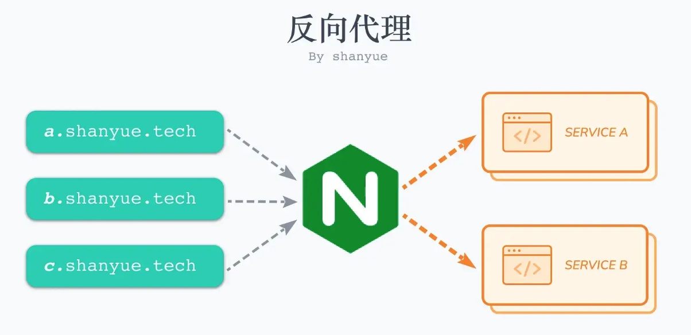
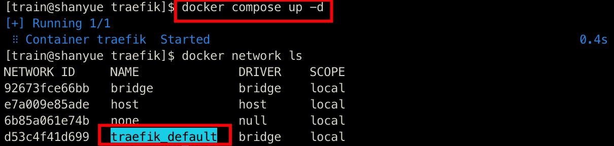
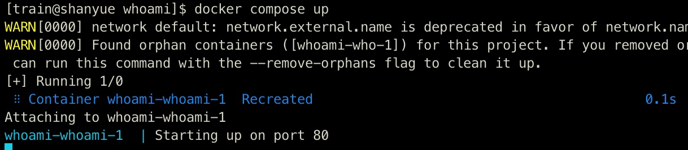
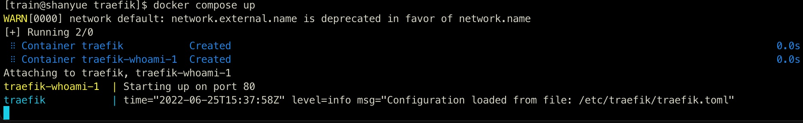
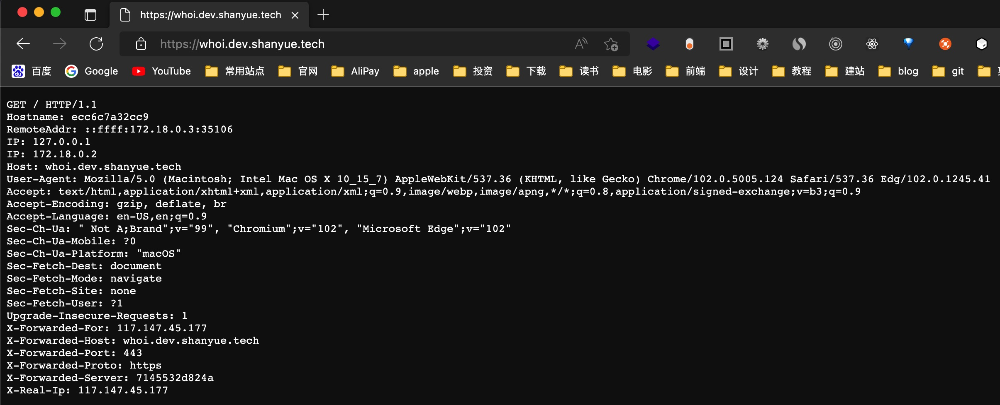
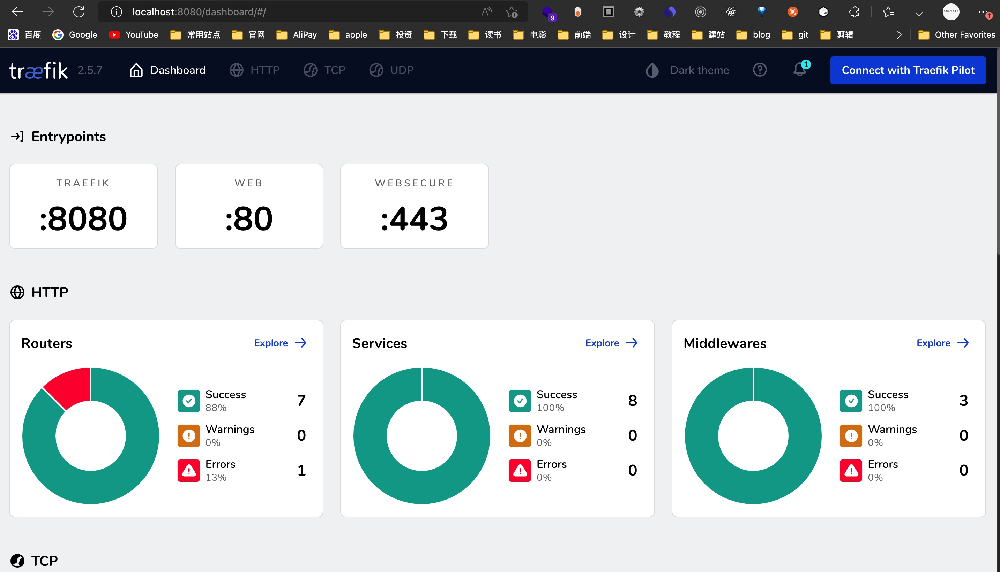

## 前置知识

### 什么是反向代理？

> 参考这篇文章的[解释](https://www.dailiproxy.com/reverse-proxy/)

反向代理是充当 `Web` 服务器网关的代理服务器。当您将请求发送到使用反向代理的 `Web` 服务器时，他们将先转到反向代理，由该代理将确定是将其路由到 `Web` 服务器还是将其阻止。

这意味着有了反向代理，您永远不会与使用它的 `Web` 服务器进行直接通信。可以将它们看作 `web` 服务器或服务器集群的某种包装器。通过负载平衡和缓存，它们可以保护 `web` 免遭攻击，并提供更好的 `web` 性能。




> 上图来源山月老师[文章](https://q.shanyue.tech/deploy/simple-intro.html#%E5%85%B3%E4%BA%8E%E9%83%A8%E7%BD%B2%E7%9A%84%E6%9B%B4%E5%A4%9A%E7%96%91%E9%97%AE%E8%A7%A3%E7%AD%94)

### 什么是网关？

大家都知道，从一个房间走到另一个房间，必然要经过一扇门。同样，从一个网络向另一个网络发送信息，也必须经过一道“关口”，这道关口就是网关。顾名思义，网关(`Gateway`)就是一个网络连接到另一个网络的“关口”。网关实质上是一个网络通向其他网络的 `IP` 地址。

通俗的解释一下：假设你的名字叫十雨，你住在一个大院子里，你的邻居有很多小伙伴，在门口传达室还有个看大门的李大爷，**李大爷就是你的网关**。当你想跟院子里的某个小伙伴玩，只要你在院子里大喊一声他的名字，他听到了就会回应你，并且跑出来跟你玩。但是你不被允许走出大门，**你想与外界发生的一切联系，都必须由门口的李大爷（网关）用电话帮助你联系**。假如你想找你的同学小明聊天，小明家住在很远的另外一个院子里，**他家的院子里也有一个看门的王大爷（小明的网关）**。但是你不知道小明家的电话号码，不过你的班主任老师有一份你们班全体同学的名单和电话号码对照表，**你的老师就是你的DNS服务器**。你们小区的李大爷会向班主任打电话，拿到具体的 ip，然后李大爷会通过ip去联系王大爷，并和小明取得联系。

### Traefik 是什么？

[`traefik`](https://github.com/traefik/traefik) 是一个现代化的反向代理与负载均衡器，它可以很容易地同 `Docker` 集成在一起使用。每当 `Docker` 容器部署成功，便可以自动在网络上进行访问。

使用 `Traefik` 的意义是什么？
1. 我使用 `docker` 新跑了一个服务，如何让它被其它服务所感知或直接被互联网所访问呢？（担任网关❓）
2. 我使用 `docker` 跑了 N 个服务，我怎么了解所有的服务的健康状态及路由呢？

## 服务编排

什么是服务编排？

服务编排是使用 `docker-compose` 实现的，他其实指的就是将各个服务（`traefik`、`whoami`）以某种方式、顺序组织起来，以便我们一次性就可以启动。

### 搭建 treafik

登陆自己的服务器 `ssh OctoberRain`，然后在服务器目录下克隆这个 [compose 项目](https://github.com/shfshanyue/compose)，`cd compose`，可以看到 `traefik`、`whoami` 两个目录。

下面是详细的 `docker-compose` 配置文件

```yaml
# traefik/docker-compose.yaml
version: '3'
services:
  reverse-proxy:
    image: traefik:v2.5
    ports:
      - "80:80"
      - "443:443"
      - "8080:8080"
    volumes:
      # 下面是挂载的文件
      - ./traefik.toml:/etc/traefik/traefik.toml # 配置文件
      - ./acme.json:/acme.json
      - ./log:/log
      - /var/run/docker.sock:/var/run/docker.sock
    container_name: traefik
    env_file: .env
    labels:
      - "traefik.http.routers.api.rule=Host(`traefik.shanyue.local`)"
      - "traefik.http.routers.api.service=api@internal"
```

接下来启动服务。

```sh
touch acme.json
chmod 600 acme.json
touch .env

docker-compose up -d
```

使用 `docker-compose up -d` 可以启动 `traefik` 服务，此时会默认新建一个 `traefik_network` 的网络。这个网络名称很重要，要记住。

可以使用 `docker network ls` 查看



### 启动 service

启动一个 `[whoami](https://hub.docker.com/r/containous/whoami)` 的简易版 Web 服务，它将会在页面上打印出一些头部信息。

```yaml
version: '3'

services:
  # 改镜像会暴露出自身的 `header` 信息
  whoami:
    image: containous/whoami
    labels:
      # 设置Host 为 whoi.dev.shanyue.tech 进行域名访问
      - traefik.http.routers.whoami.rule=Host(`whoi.dev.shanyue.tech`)
      # 下面两个是 https 的配置
      - traefik.http.routers.whoami.tls=true
      - traefik.http.routers.whoami.tls.certresolver=le
# 使用已存在的 traefik 的 network    
networks:
  default:
    external:
      name: traefik_default
```

使用 `docker compose up` 启动，如下图



### 合并 docker-compose 文件

上面两个配置文件其实可以合并为一个 `docker-compose`

```yaml
version: '3'

services:
  reverse-proxy:
    image: traefik:v2.5
    ports:
      - "80:80"
      - "443:443"
      - "8080:8080"
    volumes:
      - ./traefik.toml:/etc/traefik/traefik.toml
      - ./acme.json:/acme.json
      - ./log:/log
      - /var/run/docker.sock:/var/run/docker.sock
    container_name: traefik
    env_file: .env
    labels:
      - "traefik.http.routers.api.rule=Host(`traefik.shanyue.local`)"
      - "traefik.http.routers.api.service=api@internal"
  whoami:
    image: containous/whoami
    labels:
      - traefik.http.routers.whoami.rule=Host(`whoi.dev.shanyue.tech`)
      - traefik.http.routers.whoami.tls=true
      - traefik.http.routers.whoami.tls.certresolver=le

networks:
  default:
    external:
       name: traefik_default
```

执行 `docker compose up`



最终访问结果如下：



### 终极 traefik.toml 配置文件

见此处 [github](https://github.com/shfshanyue/compose/blob/master/traefik/traefik.toml)

## 总结

### 什么是服务编排？

服务编排是使用 `docker-compose` 实现的，他其实指的就是将各个服务（`traefik`、`whoami`）以某种方式、顺序组织起来，以便我们一次性就可以启动。

### Treafik 的意义是什么？

1. 我使用 `docker` 新跑了一个服务，如何让它被其它服务所感知或直接被互联网所访问呢？
2. 我使用 `docker` 跑了 N 个服务，我怎么了解所有的服务的健康状态及路由呢？


### Treafik 和 nginx 的区别是什么？

1. 无须重启即可更新配置
2. 自动的服务发现与负载均衡
3. 与 `docker` 完美集成，基于 `container label` 的配置
4. 漂亮的 `dashboard` 界面
5. `metrics` 的支持，支持对 `prometheus` 和 `k8s` 集成

## 附录

### 如何查看 traefik 的 dashboard

如果想在本地机器，查看服务器上的 `traefik` 服务的 `dashboard` 面板，我们可以开启一个 `ssh` 隧道，使用 `ssh -NL 8080:localhost:8080 shanyue`(表示将服务的 8080 端口暴露到宿主机 8080 端口上)，什么也没返回表示成功。

在本地访问 `localhost:8080`，可见下图。



在这里我们可以查看 `traefik` 网关的详细信息。


## 参考

[shanyue：服务编排: 服务发现与 Traefik 网关搭建](https://q.shanyue.tech/deploy/traefik.html#traefik-%E6%90%AD%E5%BB%BA)

[掘金：Traefik--云原生下的Nginx替代品](https://juejin.cn/post/6976883580693643294)

[掘金：一文带你搞清楚Traefik](https://juejin.cn/post/7105555246663794725)

